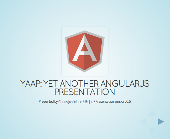

# AngularJS Presentation

This is Yet Another AngularJS Presentation. I set out to create a simple presentation for my team mates at EstateAssist. A week later I was still deep down the rabbit hole. Angular isn't an easy framework to cover and it's difficult to do it justice with a quick presentation.

I played around with RevealJS a while back and felt it would be a perfect platform for a presentation on Angular. Since the entire presentation runs in a web browser, I decided the presentation should include live Angular code. Heck, why not right?

The resulting presentation doesn't cover all of Angular. In fact, I specifically left out a great deal in order to make the presentation mentally digestible.

## Running locally

You can run this presentation locally by installing Grunt.

From within the project root install grunt:

    $ npm install

Then simply run grunt serve:

    $ grunt serve

Visit the presentation at:

    http://localhost:8000

## Tips for running this presentation

If you're not familiar with RevealJS the following tips might prove helpful. Try these keys while the presentation is running.

* Press the `ESCAPE` key to view a graphical overview of the presentation.
* Press the `s` key to view presenter notes. This will reveal what to present while a slide is being shown. This also lets you keep track of how long the presentation is running.
* Press the `b` key to blank a presentation slide. Do this when you want to pause the presentation and ensure that your audience isn't distracted by the current slide.

## Present `Minority Report` style!
This presentation is configured to work with the [LeapMotion](https://www.leapmotion.com) controller.  LeapMotion is a device that can detect hand gestures in 3D space. This allowed me to move between slides by gesturing above my laptop. 

Yes, you too can be that cool! While it's far from [Minority Report](http://en.wikipedia.org/wiki/Minority_Report_(film)) spacial operating environments are on their way.

## This presentation is open sourced

Feel free to fork the presentation and use it as the basis for sharing Angular with others. My presentation notes are included, but feel free to add you own.

If you'd like to contribute to this presentation simply fork it and issue a pull request.

### View the presentation here: [http://cjus.github.io/AngularPresentation/](http://cjus.github.io/AngularPresentation/)

